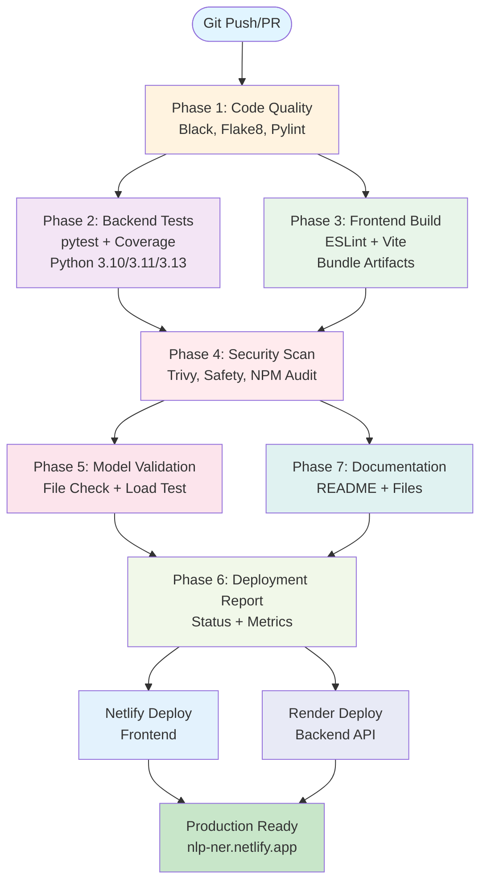

#  NER MultiCoNER - Named Entity Recognition

<div align="center">


** [Live Demo](https://nlp-ner.netlify.app) |  [API Docs](https://nlp-4g9u.onrender.com/docs) |  [Performance Metrics](#performance)**

</div>
<div align="center">
  
[Support de présentation CANVA](https://www.canva.com/design/DAHA3mGaOmc/XZGzKgxzOv7xgqywnM1tiQ/edit?utm_content=DAHA3mGaOmc&utm_campaign=designshare&utm_medium=link2&utm_source=sharebutton)
</div>
---

## 📖 À propos

Système de **Reconnaissance des Entités Nommées (NER)** avancé pour le français, développé sur le corpus **MultiCoNER v2**. Solution full-stack avec API RESTful et interface web moderne.

### ✨ Fonctionnalités

-  **Détection d'entités** - Personnes, Lieux, Organisations, etc.
-  **Analyse statistique** - Métriques détaillées et visualisations
-  **Export multi-format** - PDF, JSON, CSV
-  **Interface moderne** - React + Vite
-  **API RESTful** - FastAPI avec documentation interactive
-  **CI/CD automatisé** - GitHub Actions
-  **Sécurité** - Analyse de vulnérabilités automatique

## Structure

- data/ : fichiers CoNLL (train/dev/test)
- notebook/NER.ipynb : analyse + modélisation
- src/ : scripts Python (prétraitement, features, entraînement, évaluation, API)
- slides/presentation.md : support de soutenance (plan 25 slides max)

## Installation

```bash
pip install -r requirements.txt
```

## Entraînement

```bash
python -m src.train --data-dir data --model crf --output models/ner_model.joblib
```

Modèle baseline (logreg) :

```bash
python -m src.train --data-dir data --model logreg --output models/ner_model.joblib
```

## Évaluation

```bash
python -m src.evaluate --data-dir data --model-path models/ner_model.joblib --split dev --model-type crf
```

## API

```bash
uvicorn src.api:app --reload
```

Exemple requête :

```json
{
  "tokens": ["Emmanuel", "Macron", "est", "à", "Paris", "."]
}
```

## CI/CD Pipeline

Pipeline automatisé professionnel en 7 phases pour garantir la qualité et la sécurité du code.

### Architecture du Pipeline



### Phases du Pipeline

| Phase | Outils | Objectif | Durée |
|-------|--------|----------|-------|
| 1. Code Quality | Black, Flake8, Pylint | Vérification du formatage et de la qualité du code | 2-3 min |
| 2. Backend Tests | pytest, Coverage | Tests unitaires sur Python 3.10/3.11/3.13 | 4-6 min |
| 3. Frontend Build | ESLint, Vite | Vérification et build de l'interface React | 3-4 min |
| 4. Security Scan | Trivy, Safety, NPM Audit | Détection des vulnérabilités | 3-4 min |
| 5. Model Validation | Python | Vérification de l'intégrité du modèle NER | 1-2 min |
| 6. Deployment Report | Bash | Génération du rapport de déploiement | 1 min |
| 7. Documentation | Bash | Validation de la documentation | 1 min |

**Durée totale moyenne**: 15-20 minutes

### Métriques de Qualité

- **Code Coverage**: Suivi automatique via pytest-cov
- **Code Quality Score**: Pylint score minimal de 7.0/10
- **Security**: Zero vulnerabilités critiques tolérées
- **Build Success**: 100% des tests doivent passer

Pour plus de détails, consultez [CICD_DOCUMENTATION.md](CICD_DOCUMENTATION.md) et [PIPELINE_PRESENTATION.md](PIPELINE_PRESENTATION.md).

## Notebook

Le notebook suit les étapes :
1) Chargement et validation des données
2) Analyse exploratoire (labels)
3) Baselines (LogReg)
4) CRF séquentiel
5) Évaluation (seqeval)
6) Sauvegarde du modèle
